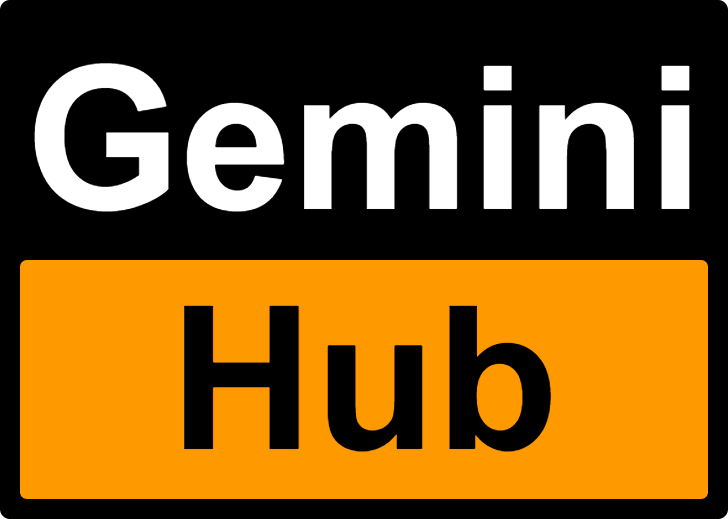

<p align="center">
  
</p>

<h1 align="left">Gemini Hub [](https://gemini-centre.streamlit.app/)</h1>

Gemini Pro Hub is a Streamlit app that integrates various features powered by Google's GEMINI models, including a chatbot, image captioning, and text embedding.

## Usage

1. **ChatBot:** Interact with the Gemini Pro model for conversational AI. Simply type your message in the input box and the chatbot will respond.

2. **Image Captioning:** Upload an image and get a descriptive caption generated by the Gemini-Pro-Vision model. Click the "Generate Caption" button to see the result.

3. **Embed text:** Enter text in the text area to convert it into embeddings using the embeddings-001 model. Click the "Get Response" button to view the embeddings.

4. **About:** Learn more about this Gemini Hub, including the models used for each feature.

## Getting Started

To run the app locally, follow these steps:

1. Clone this repository to your local machine.

   ```bash
   git clone https://github.com/hardikjp7/Gemini-Pro-Hub.git
   ```

2. Install the required dependencies by running the following command in your terminal:

   ```bash
   pip install -r requirements.txt
   ```

3. Run the Streamlit app by executing the following command in your terminal:

   ```bash
   streamlit run main.py
   ```

4. Set up your Gemini API Key by entering it in the sidebar of the app.


## Project Structure

- `app.py`: Contains the Streamlit app code.
- `gemini.py`: Contains functions for interacting with the Gemini models.
- `requirements.txt`: Contains the required Python packages.
- `logo.png`: Icon for the Streamlit app menu.

## Deployment

This project is deployed publicly on Streamlit. You can access it by clicking in right side of title

---

Made with ❤️ by [Hardik](https://www.linkedin.com/in/hardikjp/)
